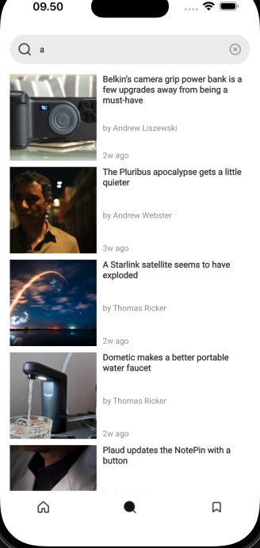

# Test SRU (NEWS)

## Link Aplikasi
[https://drive.google.com/file/d/1_W9qj2eTdmOIa4GcsP8iZ-UMqluXvL3p/view?usp=share_link](https://drive.google.com/file/d/1DS3J0jbQIkCbZLA2CzoGnOz1MK2CAogl/view?usp=sharing)

## Getting Started

Pastikan sudah menginstall Git dan Flutter pada environment kalian.

### Prerequisites

- Flutter
  ```sh
  https://docs.flutter.dev/get-started/install
  ```
- Git
  ```sh
  https://git-scm.com/downloads
  ```
  
### Installation

1. Clone the repo
   ```sh
   git clone https://github.com/fadillahnurfaq/celengaku
   ```
2. Install the dependencies
   ```sh
   flutter pub get
   ```
3. Run
   ```sh
   Run Without Debugging On Vs Code
   ```

## Detail Aplikasi

### Overview





